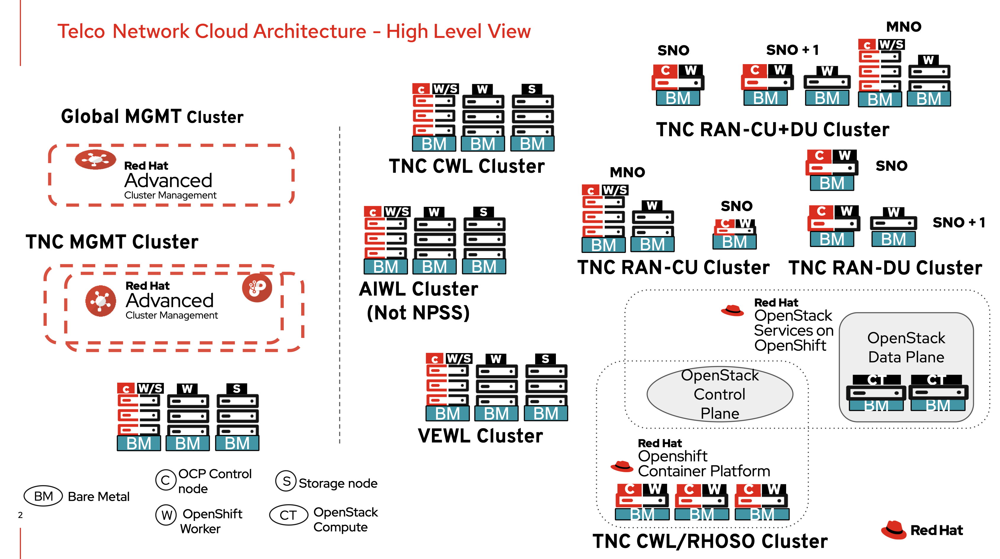

= Telco Network Cloud Reference

== Description

This repository contains the reference configurations (installation artifacts as wells as configuration policies) for the different sub-architectures under the Telco Network Cloud (TNC) reference architecture. The figure below shows the high level view of the TNC reference architecture along with its sub-architectures:

TNC uses the reference configuration, provided by the telco Reference Design Specification (RDS), as baseline and adds services/integrations to augment the RDS. 

== How to Use

The directories specific to each sub-architecture provide the configuration files needed to fully deploy and configure an OpenShift cluster with the design specified for the relevant sub-architecture. Each sub-architecture contains a directory (`<sub-architecture>/configuration/reference-crs') with the source CRs (configuration files in YAML format) coming from the corresponding RDS release, that are going to be used as the baseline. Additional CRs are provided under the `<sub-architecture>/configuration/other-crs' directory to augment the RDS reference CRs. 

Finally, most repositories provides reference policies, in the form of policygen templates that use the reference and other CRs to configure the OpenShift cluster according to the specific sub-architecture design.

While each sub-architecture contrains the reference CRs from the appropriate RDS version, those reference CRs are a point in time copy of the original RDS reference CRs. If desired, users can pull the latest version of the RDS reference CRs in order to pick any bug fixes that may have been submitted in the interim. The following procedure lists the steps needed to copy the latest RDS reference CRs.

[WARNING]
====
While the current copy of RDS referece CRs has been validated to work properly with the policy examples provided in the TNC sub-architecture repositories, there is a risk that updating the RDS reference CRs under the TNC sub-archtecture repositories may break those polcies. Users are encouraged to re-test all policies after updating the RDS reference CRs in the TNC repository.
====

=== Copying the latest RDS Reference CRs - Optional

If Desired, follow the steps below to copy the latest RDS reference CRs:

[NOTE]
====
Make sure to pick the RDS reference CRs from the branch that aligns with the TNC release. For example, TNC 6.x release aligns with the RDS branch `release-4.20`.
====

* Clone the TNC repository/branch
[source,bash]
====
git clone https://github.com/openshift-kni/telco-reference.git -b tnc-6.1
====

* Get the RDS reference CRs from the RDS branch that aligns with the TNC branch
[source,bash]
====
cd telco-reference
git clone https://github.com/openshift-kni/telco-reference.git -b release-4.20
====

* Copy the reference CRs and baseline policies
[source,bash]
====
# For TNC-CWL
cp -R telco-reference/telco-core/configuration/reference-crs tnc-reference/tnc-cwl/configuration/reference-crs
cp telco-reference/telco-core/configuration/core-baseline.yaml tnc-reference/tnc-cwl/configuration/core-baseline.yaml.rds
cp telco-reference/telco-core/configuration/core-overlay.yaml tnc-reference/tnc-cwl/configuration/core-overlay.yaml.rds
cp telco-reference/telco-core/configuration/core-finish.yaml tnc-reference/tnc-cwl/configuration/
cp telco-reference/telco-core/install/custom-manifests/* tnc-reference/tnc-cwl/install/custom-manifests/
cp telco-reference/telco-core/install/extra-manifests/* tnc-reference/tnc-cwl/install/extra-manifests/

# For TNC-GHUB
cp -R telco-reference/telco-hub/configuration/reference-crs tnc-reference/tnc-ghub/configuration/reference-crs

# For TNC-MGMT
cp -R telco-reference/telco-hub/configuration/reference-crs tnc-reference/tnc-mgmt/configuration/reference-crs

# For TNC-VEWL
cp -R telco-reference/telco-core/configuration/reference-crs tnc-reference/tnc-vewl/configuration/reference-crs
cp telco-reference/telco-core/configuration/core-baseline.yaml tnc-reference/tnc-vewl/configuration/core-baseline.yaml.rds
cp telco-reference/telco-core/configuration/core-overlay.yaml tnc-reference/tnc-vewl/configuration/core-overlay.yaml.rds
cp telco-reference/telco-core/configuration/core-finish.yaml tnc-reference/tnc-vewl/configuration/
cp telco-reference/telco-core/install/custom-manifests/* tnc-reference/tnc-vewl/install/custom-manifests/
cp telco-reference/telco-core/install/extra-manifests/* tnc-reference/tnc-vewl/install/extra-manifests/

# For TNC-RHOSO
cp -R telco-reference/telco-core/configuration/reference-crs tnc-reference/tnc-rhoso/configuration/reference-crs
cp telco-reference/telco-core/configuration/core-baseline.yaml tnc-reference/tnc-rhoso/configuration/core-baseline.yaml.rds
cp telco-reference/telco-core/configuration/core-overlay.yaml tnc-reference/tnc-rhoso/configuration/core-overlay.yaml.rds
cp telco-reference/telco-core/configuration/core-finish.yaml tnc-reference/tnc-rhoso/configuration/
cp telco-reference/telco-core/install/custom-manifests/* tnc-reference/tnc-rhoso/install/custom-manifests/
cp telco-reference/telco-core/install/extra-manifests/* tnc-reference/tnc-rhoso/install/extra-manifests/

# For TNC-AIWL
cp -R telco-reference/telco-core/configuration/reference-crs tnc-reference/tnc-aiwl/configuration/reference-crs
cp telco-reference/telco-core/configuration/core-finish.yaml tnc-reference/tnc-aiwl/configuration/
cp telco-reference/telco-core/install/custom-manifests/* tnc-reference/tnc-aiwl/install/custom-manifests/
cp telco-reference/telco-core/install/extra-manifests/* tnc-reference/tnc-aiwl/install/extra-manifests/
====

[NOTE]
====
The baseline RDS policies (`core-baseline.yaml` and `core-overlay.yaml`) that are being copied for TNC-CWL (and some other sub-architectures) require some edits to work in a TNC environment. Becasue of that those files are being copied with a `.rds` added to the filename. Users should run a diff between the existing policy file in the TNC repository and the new file being copied with the `.rds` extension and determine if there are any changes that need to be picked.
====

* Delete the RDS source files
[source,bash]
====
rm-rf telco-reference
====

